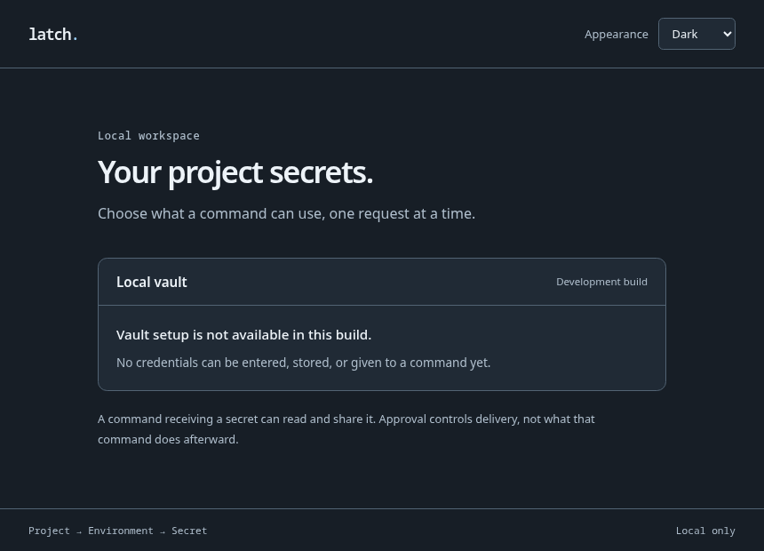
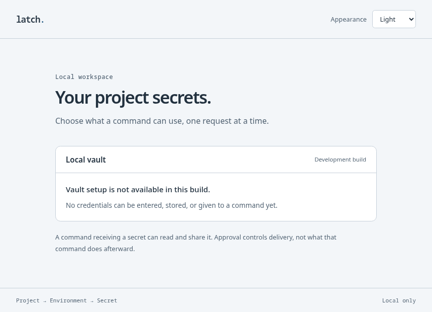

# Latch

[](https://github.com/Serendeep/latch/actions/workflows/checks.yml)
[](https://github.com/Serendeep/latch/actions/workflows/security.yml)
[](LICENSE)

A local desktop secret broker for developers and coding agents.

Latch is being built around a simple workflow: an agent requests named credentials for a project command, you enter or approve them in a desktop popup, and Latch provides the selected values to that process. Values should stay out of agent conversations and scattered `.env` files.

## Status

**Early development. This build cannot store or use secrets.**

The current application provides a desktop window with system, light, and dark appearance, plus a CLI that validates requests and refuses to launch them. Encrypted storage, approval dialogs, process injection, and audit archives are planned. Claude Code and Codex integrations have not yet been tested.

Planned capabilities include:

- A local encrypted vault organized by project and environment.
- Deliberate approval before a command receives selected secrets.
- An agent-neutral CLI for local coding tools.
- Metadata-only audit history with weekly compressed archives, retaining three archives by default. Both settings will be configurable.
- Password-encrypted portable backups.

Latch is not a general password manager or a replacement for an enterprise secrets platform. A process receiving a secret can read and leak it. See [SECURITY.md](SECURITY.md) for the security boundary and current limitations.

## Preview

The current interface in dark and light mode. These captures show application content; native title bars vary by operating system. They show the actual development UI, not a completed vault or approval flow.



<details>
<summary>Light appearance</summary>



</details>

## Run from source

Install [mise](https://mise.jdx.dev/getting-started.html) and the [Tauri prerequisites](https://v2.tauri.app/start/prerequisites/) for your operating system. Linux requires GTK 3 and WebKitGTK 4.1 development libraries.

```sh
git clone https://github.com/Serendeep/latch.git
cd latch
mise trust
mise install
mise exec -- pnpm install --frozen-lockfile
mise exec -- pnpm desktop:dev
```

The stack is Tauri 2, React, strict TypeScript 7, and Rust. mise pins Node, pnpm, and Rust; pnpm manages frontend dependencies. The title bar uses native window decorations and follows the system theme. The Appearance control changes the application content independently. On Linux, native appearance depends on the desktop's GTK theme and portal settings.

The Checks badge links to Linux, macOS, and Windows build results. A passing build does not qualify platform key-store behavior or native user journeys. Linux has also been exercised locally. There are no signed releases or automatic updates.

## CLI preview

```sh
mise exec -- cargo run -p latch-cli -- run --project . --env development --secret SERVICE_TOKEN --json -- node --version
```

This currently returns `broker_unavailable` with exit code 7 and executes nothing. Malformed requests return `invalid_input` with exit code 2. Do not pass secret values as arguments.

## Contributing

Read [CONTRIBUTING.md](CONTRIBUTING.md) for the source layout, checks, and contribution requirements. Changes are listed in [CHANGELOG.md](CHANGELOG.md). The [example configuration](examples/latch.example.toml) contains names only; it is illustrative and is not loaded by the application.

## License

Licensed under [MIT](LICENSE). Latch is a working name; trademark availability has not been checked.
