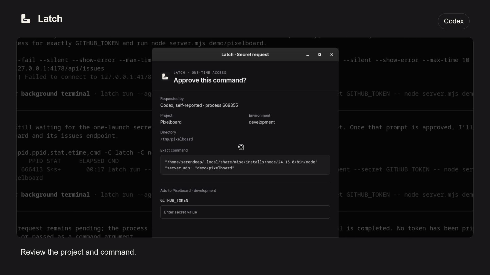
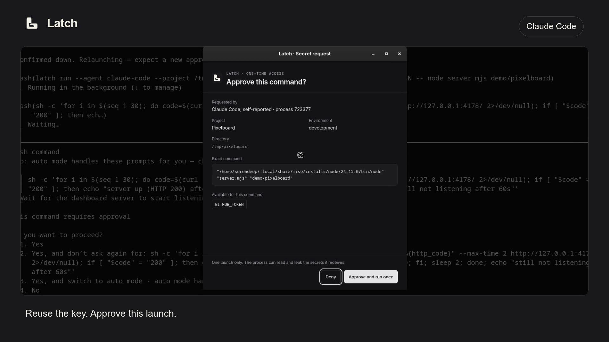
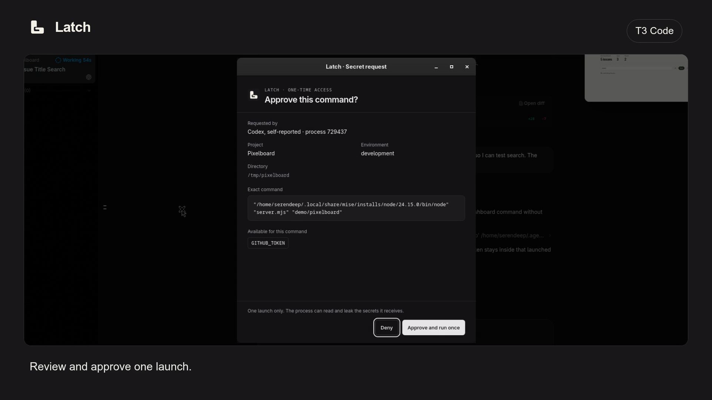

# Latch

Give a project command the secrets it needs without pasting them into your coding agent's conversation or another `.env` file.

When an agent needs a key, it asks Latch to launch a command with that named secret. A small desktop popup shows the project, environment, and exact command. You can enter a missing value, approve one launch, or deny the request. The main app stays in the tray until you need to manage your vault.

Latch is open source and local only. It uses Tauri 2, React, TypeScript, Rust, and SQLite.

## Watch it work

Each video follows a different task in a small issue dashboard, from the agent's request to the running application.

| Codex                                                                     | Claude Code                                                                                 | T3 Code                                                                         |
| ------------------------------------------------------------------------- | ------------------------------------------------------------------------------------------- | ------------------------------------------------------------------------------- |
|  |  |  |

The recordings use the actual agent applications, a local mock GitHub service, sample issues, and generated credentials. T3 Code uses its Codex provider. No real GitHub token or private repository appears in the videos.

## Current status

Latch is an early development build. Use generated test credentials while evaluating it. Linux supports the vault and command-launch flow with a password-protected GNOME login keyring. macOS and Windows build in CI, but their credential-store adapters and command transport are not ready.

You can currently:

- Organize secrets by project and environment.
- Import new entries from `.env` and compare expected names from `.env.example`.
- Reveal one value deliberately or copy it with timed clipboard clearing.
- Review agent requests, add missing secrets, and approve a single command launch.
- Keep the app in the tray and unlock from the request popup.

Latch records local audit metadata for vault operations, secret access, requests, decisions, and process exits. Audit browsing, weekly compressed archives with configurable retention, and portable encrypted backups are still planned. There are no signed releases or automatic updates yet.

## The app

Light mode

These UI previews use sample metadata and concealed values. Latch supports system, light, and dark appearance, with native title bars that follow the desktop theme.

## Documentation

Read the [documentation](site/content/docs/index.mdx) for setup, agent integration, vault management, and the security model. The guides live alongside the code and are built as a separate website.

Approval controls which process receives a secret. **That process can read and leak it.** Latch does not sandbox approved commands.

## Contributing

See [CONTRIBUTING.md](CONTRIBUTING.md) for setup, checks, and contribution requirements, and [CHANGELOG.md](CHANGELOG.md) for changes. The [example configuration](examples/latch.example.toml) contains names only and is not loaded by the app.

## License

[MIT](LICENSE).
