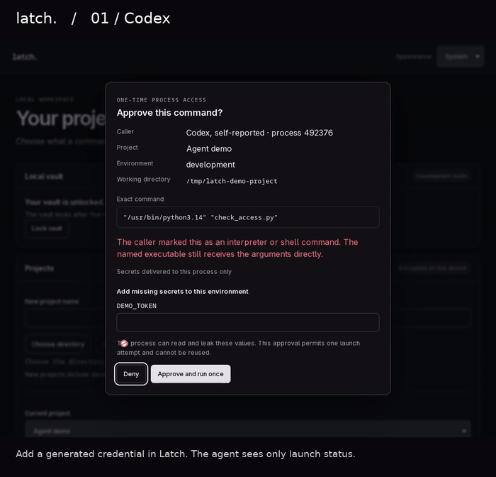
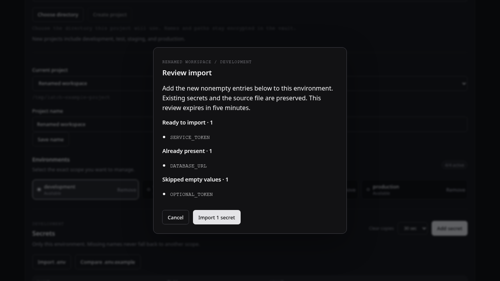
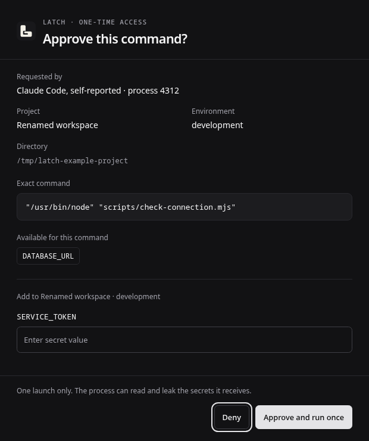

# Latch

[](https://github.com/Serendeep/latch/actions/workflows/checks.yml)
[](https://github.com/Serendeep/latch/actions/workflows/security.yml)
[](LICENSE)

A local desktop secret broker for developers and coding agents.

Latch is being built around a simple workflow: an agent requests named credentials for a project command, you enter or approve them in a desktop popup, and Latch provides the selected values to that process. Values should stay out of agent conversations and scattered `.env` files.

## Status

**Early development. Linux now has a first end-to-end agent request and one-time command launch path alongside vault, project, secret, clipboard, and import flows. Use generated test credentials only.**

On Linux, you can create an empty encrypted vault, unlock it with a separate Latch passphrase, and lock it again. The first credential-store adapter requires GNOME Keyring’s unlocked, password-protected login collection. macOS and Windows vault operations remain unavailable pending native credential-store qualification.

Vault keys stay in Rust. SQLite stores the authenticated wrapped key and separately encrypted secret metadata and values; the GNOME login keyring stores separate random device material. Unlocking requires both that material and the passphrase. The vault locks after five minutes, and explicit locking cancels outstanding operations. Audit records cover vault creation, unlock outcomes, locking, project/environment changes, secret changes, individual reveals, copy access, imports, comparisons, agent requests, decisions, per-secret dispatch, and process exit. Weekly archives are not implemented yet.

The desktop follows system, light, or dark appearance. The Linux CLI communicates over an owner-only Unix socket. Codex, Claude Code, and other agents use the same CLI contract; the caller label is self-reported and does not grant authority. macOS and Windows command transport remain unavailable.

Planned capabilities include:

- Metadata-only audit history with weekly compressed archives, retaining three archives by default. Both settings will be configurable.
- Password-encrypted portable backups.

Latch is not a general password manager or a replacement for an enterprise secrets platform. A process receiving a secret can read and leak it. See [SECURITY.md](SECURITY.md) for the security boundary and current limitations.

## Agent demo

[](https://github.com/Serendeep/latch/blob/main/docs/assets/latch-agents-demo.mp4)

[Watch or download the MP4](https://github.com/Serendeep/latch/raw/refs/heads/main/docs/assets/latch-agents-demo.mp4).

Recorded from the installed Linux desktop with a disposable vault and generated credentials. Codex and Claude Code issued their requests through their actual CLIs; the T3 Code request came through an agent terminal tool in a T3 Code session and appears as **Other agent**. Each request required popup approval, and all three child processes exited with code 0. The recording shows Latch's window, with chapter captions added during editing. Caller labels are self-reported.

## Preview

Development preview of project, environment, and secret metadata management in dark and light mode, captured from the current UI with a simulated unlocked vault. Values remain concealed and the examples contain no credentials. These captures show application content; native title bars vary by operating system.


<details>
<summary>Light appearance</summary>


</details>

## Run from source

Install [mise](https://mise.jdx.dev/getting-started.html) and the [Tauri prerequisites](https://v2.tauri.app/start/prerequisites/) for your operating system. Linux requires GTK 3 and WebKitGTK 4.1 development libraries.

```sh
git clone https://github.com/Serendeep/latch.git
cd latch
mise trust
mise install
mise exec -- pnpm install --frozen-lockfile
mise exec -- pnpm desktop:dev
```

The stack is Tauri 2, React, strict TypeScript 7, and Rust. mise pins Node, pnpm, and Rust; pnpm manages frontend dependencies. The title bar uses native window decorations and follows the system theme. The Appearance control changes the application content independently. On Linux, native appearance depends on the desktop's GTK theme and portal settings.

The Checks badge links to Linux, macOS, and Windows build results. A passing build does not qualify platform key-store behavior or native user journeys. Linux has also been exercised locally. There are no signed releases or automatic updates.

## Linux vault setup

Run the desktop app, enter and confirm a separate passphrase of at least 15 characters, and choose **Create vault**. Creation finishes locked. Enter the same passphrase to unlock. The fields are concealed and cleared after submission; passphrases are never trimmed. There is no password reset or backup recovery in this build. Do not use it for real credentials yet.

The current adapter checks for `/usr/bin/gnome-keyring-daemon`, the login collection, and its protected on-disk format before storing material. A missing, locked, plaintext, or unsupported store is rejected. Unlock the login keyring through your desktop's password manager and retry. Latch does not change that collection's password or unlock it automatically.

The vault directory is `$XDG_DATA_HOME/local.latch.development/vault`, or `~/.local/share/local.latch.development/vault` when `XDG_DATA_HOME` is unset. It is separate from webview storage, private to your user, and restricted to one broker process. Do not edit or copy individual SQLite sidecar files while Latch is running.

### Projects and environments

After unlocking, enter a project name and choose its directory through the native folder picker. Review the canonical path, then choose **Create project**. The Linux picker uses GTK through the Tauri dialog plugin. Its acceptance flow still needs native qualification; the headless automation attempt did not complete.

Each project starts with development, test, staging, and production. Use **Current project** to switch between projects on the current page. The vault supports 100 projects, shown in pages of 20. Names and directory bindings must be unique; names are compared without ASCII case distinctions.

Renaming preserves the directory binding. Removing an environment requires confirmation; recreating it gives it a fresh identity. Deleting a project removes its vault metadata and preserves the workspace directory and audit history. There is no undo or directory-rebinding flow yet. A directory association supplies context for future command approval; it is not a filesystem sandbox.

### Secrets

Select an environment, then add a variable name, optional description and tags, and its value. Names are unique within that environment without ASCII case distinctions. Lists decrypt and return metadata only; a value reaches the webview only after choosing **Reveal** for that one record, and is concealed again after 15 seconds or a scope change. Create, update, delete, and reveal each record metadata-only audit events.

The value entry uses an uncontrolled password field and clears when submitted or dismissed. JavaScript and operating-system memory cannot be guaranteed to be wiped. **Copy** never returns the value to React and can clear it after 15, 30, or 60 seconds. Latch clears only when the clipboard still contains its latest copied value, so a later user copy is preserved. Platform history-exclusion hints are best effort; clipboard managers and same-user software can still read or retain copied values. This remains an early development build; use generated test credentials while evaluating it.

### Import and compare configuration



Choose a project and environment, then **Import .env** and select a file in the native picker. Review the variable names before confirming. Latch imports new nonempty entries together, skips existing names and empty values, and records the operation in local audit history. The source file stays on disk. A review expires after five minutes or when the vault locks. Selecting a different file replaces the pending review.

**Compare .env.example** shows missing and present names for that environment. It ignores example values and creates no secrets. Comparison results are a snapshot; compare again after changing the environment's secrets.

Files must be UTF-8, at most 1 MiB, with at most 256 unique assignments. Import supports `NAME=value`, optional `export `, blank lines, comments, and literal single-line quoted values. An unquoted `#` starts a comment at the beginning of the value or after whitespace. Quotes can be followed by a comment. Interpolation, dollar signs, backticks, backslash escapes, and multiline values are rejected. Duplicate names reject the file without writes, including names differing only by ASCII case. Example comparison reads assignment names and ignores everything after `=`.

Imported values stay in Rust. Pending reviews hold encrypted candidates, so changing the source file after review cannot change the imported values. Import does not erase plaintext source files or protect them from other local software.

### Interrupted first setup

Latch preserves an incomplete setup instead of overwriting it. Quit Latch and preserve the entire `vault` directory for inspection. For an empty development vault that has never held project secrets, you can rename that directory and restart Latch to create a fresh one. This creates a new vault; it does not recover the old one. An interrupted setup may leave an unused OS keyring item. Do not delete keyring items whose association you have not verified.

If a previously created vault fails to unlock, preserve its directory and OS keyring item. Renaming files, changing the keyring password to empty, or deleting device material will not recover its passphrase.

## Agent requests and command launch



```sh
mise exec -- cargo run -p latch-cli -- run --project . --env development --secret SERVICE_TOKEN --json -- node --version
```

Keep the Linux desktop open and the vault unlocked. Latch resolves the project directory and executable before showing a modal review with the claimed agent, OS-observed process ID, exact executable and arguments, environment, and requested names. Missing names can be entered in the popup; approval encrypts them into that project environment and launches the command once. Existing vault values never enter the webview.

The broker invokes the reviewed executable directly, clears its inherited environment, and adds a small baseline (`HOME`, `TMPDIR`, `LANG`, `PATH`, and locale variables when present) plus only the named secrets. It does not capture child input or output. Add `--shell` when the executable is intentionally a shell or interpreter; Latch still passes its argument vector directly. A child process receiving an environment variable can read and leak it.

Use `--agent codex`, `--agent claude-code`, or the default `other`. This is a self-reported audit label; peer UID and PID come from the Unix socket. The request expires after five minutes, only one approval may be pending, and eight launched processes may be tracked at once. `--wait`, requests without named secrets, macOS/Windows transport, process cancellation, and audit browsing are not implemented. Fixed exit codes distinguish denial, locked vault, stale review, queue limits, launch failure, and unavailable broker. Malformed requests return `invalid_input` with exit code 2. Never pass secret values as arguments.

[`integrations/latch/SKILL.md`](integrations/latch/SKILL.md) is a small model-invoked integration for agents that support skills. Other coding agents can call the same CLI directly; the protocol does not depend on a particular agent vendor.

## Contributing

Read [CONTRIBUTING.md](CONTRIBUTING.md) for the source layout, checks, and contribution requirements. Changes are listed in [CHANGELOG.md](CHANGELOG.md). The [example configuration](examples/latch.example.toml) contains names only; it is illustrative and is not loaded by the application.

## License

Licensed under [MIT](LICENSE). Latch is a working name; trademark availability has not been checked.
